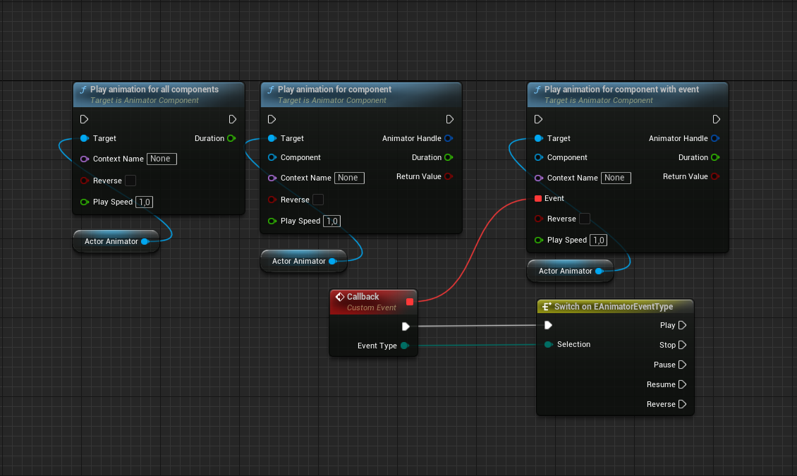
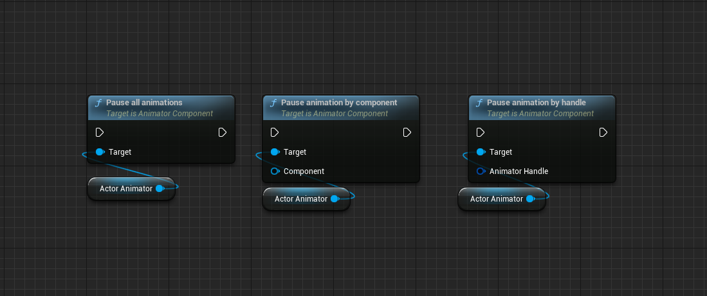
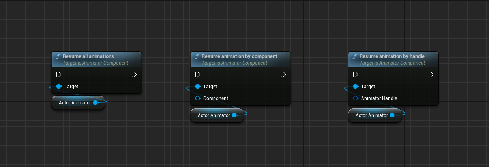
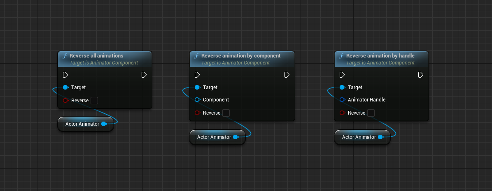
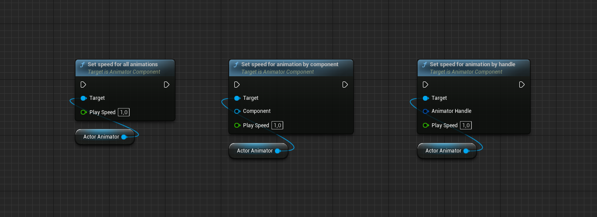
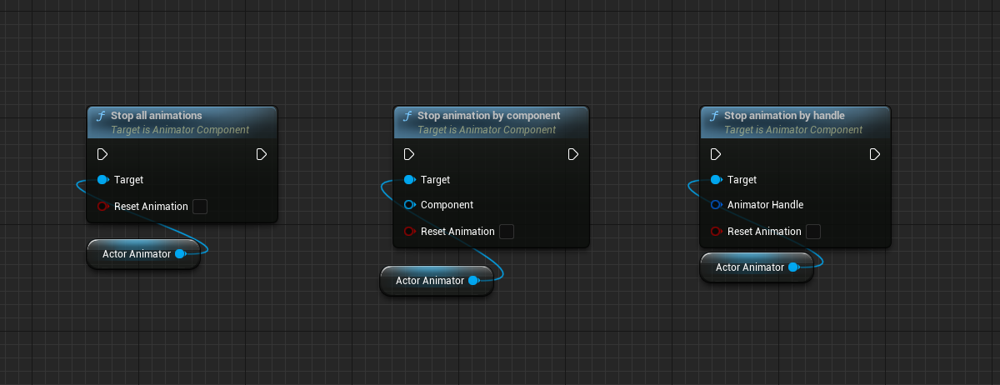
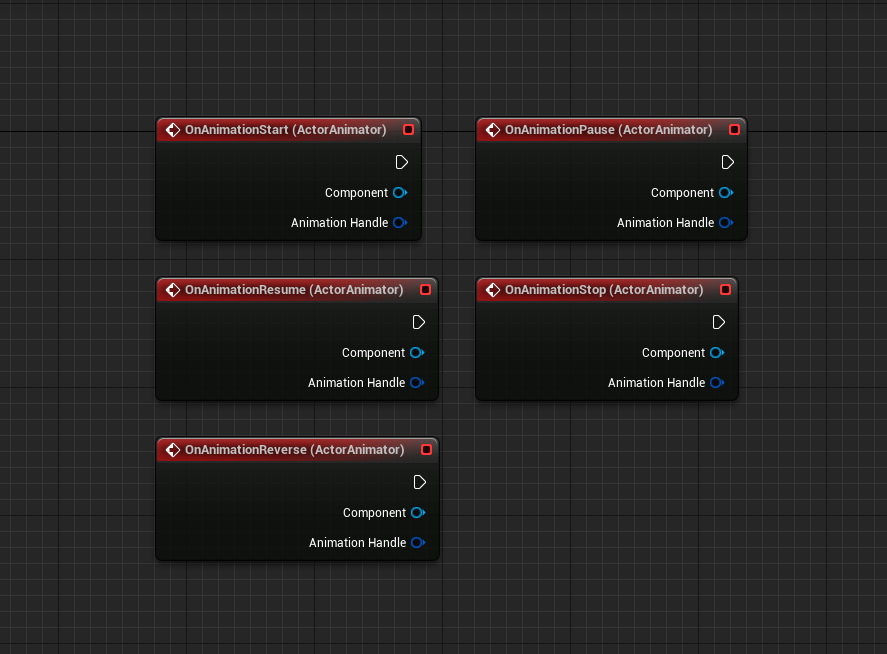

# Actor animator
# What is it?
**[Actor animator](https://www.unrealengine.com/marketplace/en-US/product/actor-animator-animate-any-actor-using-curves-and-splines)** is a plugin that allows you to animate the components of the actors using curves and splines. With this plugin, you can easily create smooth and realistic animations that can be used in various projects, including games, architectural renderings, and others.

# Features

* Animate location by curves
* Animate location by internal splines (inside actor)
* Animate location by external splines (link any external actor with spline component)
* Animate scale by curves
* Animate rotation by curves
* Animate light color by curves
* Animate light intensity by curves
* Animate light temperature by curves
* Animate location by wind source (experimental)
* Create custom animation blueprints for any additional logic
* Create presets for reusing animations for any count of actors
* In any time pause/stop/reverse/change play speed for any animations
* Use animation contexts for extend animation logic
* Auto-play with delay/contexts
* Animate any actors placed to level (with some limitations)
* Combinate animations

# Table of content:
- [How it is work?](#how-it-is-work)
- [Demo project](#demo-project)
- [Example project](#example-project)
- [Lessons](#lessons)
- [Blueprint nodes](#blueprint-nodes)
- [FAQ](#faq)
- [Support](#support)

# How it is work?

* You add a component to any actor
* Set up animations for each component (based on SceneComponent)
* Start animations using blueprints or autoplay (delayed start is supported)
* The component enable tick and creates a pool of animations for processing based on animation fragments (using the CDO version of the classes)
* In a tick, each fragment is processed and the object transformation / or any additional data is changed at the output
* The result of all animation fragments is summed by default, which allows you to combine different sets of animation fragments
* When animation fragments finish playing they are removed from the processing queue
* When the queue is empty, the tick of the component turns off

# Demo project

[Click to download](https://drive.google.com/drive/folders/1RpsGlOxJuXJXH9qz6R3vsVLfQi4WA3z6)

[Click to watch demo overview](https://www.youtube.com/watch?v=ltEAlfIhgAo)

# Example project

[Click to download](https://drive.google.com/drive/folders/1gdHLp2W7--clUQg_rnfmPyicdMbNvKX7)

# Lessons

Please see our youtube tutorials for get examples how to use plugin: [Click here to watch](https://www.youtube.com/playlist?list=PLz2Nf3UDHR63MacOOsv3kTczdiK8AG1yB)

# Blueprint nodes
# Play

# Pause

# Resume

# Reverse

# Set speed

# Stop

# Events

# FAQ

Q: **I can do the same on blueprints and timelines. Why do I need your plugin?**

A: You can create extensive logic when using the plugin, use animation presets to avoid duplication, and much more. With the plugin, you will achieve the desired result much faster.

Q: **What platforms are supported?**

A: Potentially it should work on any platform

# Support

If you have any additional questions or suggestions, do not hesitate to express them. You can

do it through our official discord group or via email

**Discord** : [Click to join](https://discord.gg/4FtCJnMuxb)

**Email** : [support@space-raccoon.com](mailto:support@space-raccoon.com)
